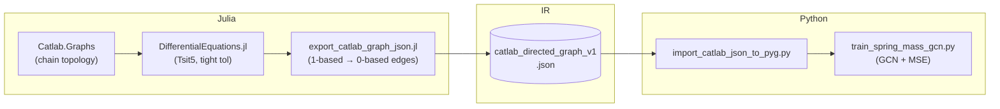
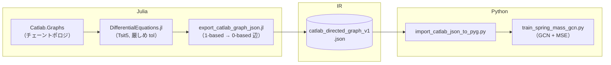

# Physics GNN Surrogate · 1D Spring–Mass Chain — Phase 1

[](https://julialang.org/)
[](https://www.python.org/)
[](https://pytorch-geometric.readthedocs.io/)

[🇺🇸 English](#english) | [🇯🇵 日本語](#japanese)

**Phase 1** — Catlab.jl graph semantics, DifferentialEquations.jl ground truth, and PyTorch Geometric training, exchanged through a versioned JSON intermediate representation (`catlab_directed_graph_v1`).

---

<a id="english"></a>

## 🇺🇸 English

### 📌 Title & overview

Graph surrogate baseline for a **1D spring–mass chain** (Hookean springs, **free ends**). Interaction topology is a **Catlab `Graph`** (compositional, ACT-friendly); dynamics are integrated in Julia and serialized for **GCN** node regression in PyTorch Geometric.

| Layer | Role |
|--------|------|
| **Physics & topology (Julia)** | High-fidelity ODE reference + **directed multigraph** encoding of pairwise springs (bidirected edges). |
| **IR (JSON)** | Loosely coupled **`catlab_directed_graph_v1`** payload: `num_nodes`, `edges`, optional `x` / `y`. |
| **Learning (Python)** | `torch_geometric.data.Data` → two-layer **GCN** + **MSE** (`train_spring_mass_gcn.py`). |

**Supervision (default export):** `x` = per-node **position & velocity at \(t=0\)**; `y` = same features at **\(t=t_1\)** from `DifferentialEquations.jl`.

**Default numerical / physical settings** (`spring_mass_chain_export.jl`, `main` kwargs):

| Item | Default | Note |
|------|---------:|------|
| `n` | 5 | Number of masses (chain length). |
| `k` | `1.0` | Spring constant (Hooke’s law between neighbors). |
| `m` | `1.0` | Mass per node. |
| `t1` | `0.1` | Integration horizon for `y`. |
| `seed` | `42` | RNG seed for `x` (`nothing` to skip fixing). |
| ODE solver | `Tsit5()` | `abstol = reltol = 1e-10`; `saveat = t1`. |

---

### 🏗 Architecture

| Stage | Stack | Responsibility |
|--------|--------|------------------|
| **Topology** | **Catlab.jl** (`Catlab.Graphs`) | Build the mechanical network as a **directed graph** (symmetric coupling → opposite directed edges). |
| **Ground truth** | **DifferentialEquations.jl** | First-order state \(z=[u_1,\ldots,u_n,v_1,\ldots,v_n]\); integrate \((0,t_1)\) with tight tolerances. |
| **Serialization** | **JSON3** (`export_catlab_graph_json.jl`) | Emit **`catlab_directed_graph_v1`**; enforce **0-based** edge endpoints for PyG. |
| **Surrogate** | **PyTorch Geometric** | Load JSON → `Data` → **GCN** training. |

- **Graph semantics:** springs between adjacent masses → edges \((i,i{+}1)\) and \((i{+}1,i)\) for all \(i\).
- **ODE (scalar chain, free ends):** \(u_1''=(k/m)(u_2-u_1)\); interior \(u_i''=(k/m)(u_{i+1}-2u_i+u_{i-1})\); \(u_n''=(k/m)(u_{n-1}-u_n)\).

#### Data / index contract (IR specification)

Julia / Catlab vertex IDs are **1-based**. PyTorch Geometric expects **`edge_index` with 0-based node indices**. This pipeline **subtracts 1 at JSON export** for every edge endpoint so Python loaders need **no manual reindexing** — the file is already aligned with `Data.edge_index`.

```julia
function catlab_graph_edges_0based(g)
    pairs = Vector{Vector{Int}}()
    for e in edges(g)
        push!(pairs, [src(g, e) - 1, tgt(g, e) - 1])
    end
    pairs
end
```

**Rationale:** index semantics are part of the **published IR contract**, not an implicit loader convention.

#### End-to-end flow



---

### 📁 File structure

| Path | Role |
|------|------|
| **`Project.toml`**, **`Manifest.toml`** | Julia dependencies & reproducible resolution. |
| **`export_catlab_graph_json.jl`** | `Graph` → JSON; optional `x`,`y`; **0-based** `edges`. |
| **`spring_mass_chain_export.jl`** | Demo driver: graph → ODE → `spring_mass_chain_5.json` (defaults overridable via `main(; …)`). |
| **`spring_mass_chain_5.json`** | Checked-in sample artifact. |
| **`import_catlab_json_to_pyg.py`** | JSON → `torch_geometric.data.Data`. |
| **`train_spring_mass_gcn.py`** | GCN training loop. |
| **`requirements.txt`** | `torch`, `torch-geometric`. |

> If `export_catlab_graph_json.jl` is run as **`PROGRAM_FILE`**, it also writes `graph_from_catlab.json` for smoke tests (separate from the spring–mass `include` workflow).

---

### 🚀 Quick start

**Julia — environment & data generation**

```bash
julia --project=. -e 'using Pkg; Pkg.instantiate()'
julia --project=. spring_mass_chain_export.jl
```

**Python — install & training**

```bash
pip install -r requirements.txt
python train_spring_mass_gcn.py
```

**PyTorch Geometric:** CPU-only environments often work with the commands above. For **CUDA**, install a **matching** PyTorch build first, then use the [official PyG installation guide](https://pytorch-geometric.readthedocs.io/en/latest/install/installation.html) for compatible wheels.

---

### 📚 References (series)

| Part | Link |
|------|------|
| **Article 1 (architecture & IR)** | [Zenn — Phase 1 architecture & data coupling](https://zenn.dev/kohmaruworks/articles/phase1-architecture) |
| **Articles 2–3** | *Forthcoming* |

---

<a id="japanese"></a>

## 🇯🇵 日本語

### 📌 タイトルと概要

**1 次元ばね–質量直列系**（隣接間はフックの法則、**自由端**）を対象とした、**グラフサロゲート Phase 1** の参照実装です。相互作用のトポロジは **Catlab の有向グラフ**で記述し、Julia で参照解を生成したうえで、**PyTorch Geometric（GCN）** による学習に回します。

| 層 | 役割 |
|--------|------|
| **物理・トポロジ（Julia）** | 高精度 ODE 参照解 + バネ連結を **双方向有向辺** で表した **合成可能なグラフ IR**。 |
| **中間表現（JSON）** | **`catlab_directed_graph_v1`**（`num_nodes`, `edges`, 任意で `x` / `y`）による疎結合データ契約。 |
| **学習（Python）** | `Data` 化 → 2 層 **GCN** + **MSE**（`train_spring_mass_gcn.py`）。 |

**教師信号（デフォルト出力）:** `x` = 各ノードの **\(t=0\)** における位置・速度、`y` = **`DifferentialEquations.jl`** で積分した **\(t=t_1\)** の位置・速度。

**既定の数値・物理パラメータ**（`spring_mass_chain_export.jl` の `main` キーワード引数）:

| 項目 | 既定値 | 説明 |
|------|--------:|------|
| `n` | 5 | 質点数（チェーン長）。 |
| `k` | `1.0` | バネ定数（隣接間のフックの法則）。 |
| `m` | `1.0` | 各質点の質量。 |
| `t1` | `0.1` | `y` を取る積分ホライズン。 |
| `seed` | `42` | `x` 生成用 RNG（`nothing` で固定しない）。 |
| ODE ソルバ | `Tsit5()` | `abstol = reltol = 1e-10`；`saveat = t1`。 |

---

### 🏗 アーキテクチャ

| 段階 | スタック | 担当 |
|--------|--------|------|
| **トポロジ** | **Catlab.jl**（`Catlab.Graphs`） | 力学ネットワークを **有向グラフ**化（対称相互作用 → 逆向き辺の対）。 |
| **参照解** | **DifferentialEquations.jl** | 1 階化状態 \(z=[u_1,\ldots,u_n,v_1,\ldots,v_n]\) を \((0,t_1)\) で厳しめ許容誤差積分。 |
| **シリアライズ** | **JSON3**（`export_catlab_graph_json.jl`） | **`catlab_directed_graph_v1`** を出力；PyG 向けに辺端点を **0-based** で固定。 |
| **サロゲート** | **PyTorch Geometric** | JSON → `Data` → **GCN** 学習。 |

- **グラフ意味論:** 隣接質点間のバネ → 全 \(i\) について \((i,i{+}1)\) と \((i{+}1,i)\) の辺。
- **ODE（自由端スカラーチェーン）:** \(u_1''=(k/m)(u_2-u_1)\)；内部 \(u_i''=(k/m)(u_{i+1}-2u_i+u_{i-1})\)；\(u_n''=(k/m)(u_{n-1}-u_n)\)。

#### データ／インデックス契約（IR 仕様）

Julia / Catlab の頂点 ID は **1 始まり**ですが、PyTorch Geometric の **`edge_index` は 0 始まり**です。本リポジトリでは **JSON エクスポート時に各辺の端点から 1 を減算**し、Python 側で **オフセット補正なし**に `Data` を構築できるようにします。

```julia
function catlab_graph_edges_0based(g)
    pairs = Vector{Vector{Int}}()
    for e in edges(g)
        push!(pairs, [src(g, e) - 1, tgt(g, e) - 1])
    end
    pairs
end
```

**設計意図:** インデックス意味を **中間表現の公開仕様**として固定し、ローダ実装に暗黙の前提を散らさないようにする。

#### エンドツーエンドの流れ



---

### 📁 ファイル構成

| パス | 役割 |
|------|------|
| **`Project.toml`**, **`Manifest.toml`** | Julia 依存関係と再現可能な解決結果。 |
| **`export_catlab_graph_json.jl`** | `Graph` → JSON；任意 `x`,`y`；**辺は 0-based**。 |
| **`spring_mass_chain_export.jl`** | デモドライバ：グラフ → ODE → `spring_mass_chain_5.json`（`main(; …)` で上書き可）。 |
| **`spring_mass_chain_5.json`** | リポジトリ同梱のサンプル成果物。 |
| **`import_catlab_json_to_pyg.py`** | JSON → `torch_geometric.data.Data`。 |
| **`train_spring_mass_gcn.py`** | GCN 学習ループ。 |
| **`requirements.txt`** | `torch`, `torch-geometric`。 |

> `export_catlab_graph_json.jl` を **`PROGRAM_FILE` として単体実行**すると、スモーク用に `graph_from_catlab.json` も生成されます（ばね–質量の `include` 経路とは別）。

---

### 🚀 クイックスタート

**Julia — 環境構築とデータ生成**

```bash
julia --project=. -e 'using Pkg; Pkg.instantiate()'
julia --project=. spring_mass_chain_export.jl
```

**Python — インストールと学習**

```bash
pip install -r requirements.txt
python train_spring_mass_gcn.py
```

**PyTorch Geometric:** CPU のみなら上記で足りることが多いです。**CUDA** 利用時は、先に **CUDA 対応 PyTorch** を入れたうえで、[PyG 公式のインストール手順](https://pytorch-geometric.readthedocs.io/en/latest/install/installation.html) に従って wheel を選んでください。

---

### 📚 参考文献（シリーズ）

| 回 | リンク |
|------|------|
| **第1回（アーキテクチャ・IR）** | [Zenn — 全体アーキテクチャとデータ連携の設計思想](https://zenn.dev/kohmaruworks/articles/phase1-architecture) |
| **第2回・第3回** | *執筆中* |
