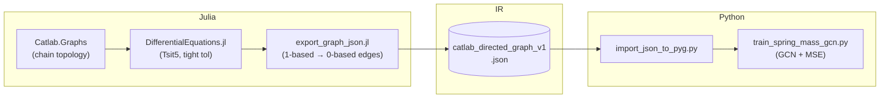
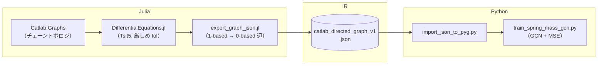

# Physics GNN Surrogate · 1D Spring–Mass Chain — Foundation Module

[](https://julialang.org/)
[](https://www.python.org/)
[](https://pytorch-geometric.readthedocs.io/)

[🇺🇸 English](#english) | [🇯🇵 日本語](#japanese)

**Foundation Module** — Catlab.jl graph semantics, DifferentialEquations.jl ground truth, and PyTorch Geometric training, exchanged through a versioned JSON intermediate representation (`catlab_directed_graph_v1`). The [Application Module](https://github.com/kohmaruworks/physics-gnn-surrogate-act) builds scale / multiphysics demos on the same contracts.

This repository is written so that **language boundaries**, the **0-based Contract**, and **compositionality** are easy to explain (e.g. YouTube **Mathematical Science Note**).

---

<a id="english"></a>

## 🇺🇸 English

### Architecture design rules

**A. Language boundary and data schema**

- **Julia:** physics, graph topology (`Catlab`), ODE reference (`DifferentialEquations`), serialization (`JSON3`).
- **Python:** learning and inference (PyTorch Geometric).
- The interchange is JSON tagged **`format == "catlab_directed_graph_v1"`** — single source of truth for `num_nodes`, `edges`, and optional `x` / `y`.

**B. Index safety — 0-based Contract**

- Julia / Catlab vertex IDs are **1-based**; PyG `edge_index` is **0-based**.
- **Required:** apply **`−1` exactly once**, only on the **Julia export boundary** (`src_julia/export_graph_json.jl` via `catlab_graph_edges_0based`).
- **Forbidden in Python:** `edge_index -= 1` in `src_python/import_json_to_pyg.py`. The loader **casts** JSON `edges` to `torch.long` and transposes to `(2, |E|)` — nothing else.

**C. Readability and compositionality**

- Message passing is factored so future **multi-physics** blocks (springs, dampers, fluids, …) can **compose** as separate layers or hetero towers.
- Reference update (Kipf & Welling–style; implemented with `GCNConv`):

\[
\mathbf{h}_i^{(\ell+1)} = \sigma\left( \sum_{j\in\tilde{\mathcal{N}}(i)} c_{ij} \mathbf{W}^{(\ell)} \mathbf{h}_j^{(\ell)} \right)
\]

- A composable baseline lives in `src_python/models/physics_gnn_base.py` (`PhysicsGNNLayer`, `PhysicsGNN`, `TwoLayerGCN`).

### 📌 Overview

Graph surrogate baseline for a **1D spring–mass chain** (Hookean springs, **free ends**). Interaction topology is a **Catlab `Graph`** (compositional, ACT-friendly); dynamics are integrated in Julia and serialized for **GCN** node regression in PyTorch Geometric.

| Layer | Role |
|--------|------|
| **Physics & topology (Julia)** | High-fidelity ODE reference + **directed multigraph** encoding of pairwise springs (bidirected edges). |
| **IR (JSON)** | Loosely coupled **`catlab_directed_graph_v1`** payload: `num_nodes`, `edges`, optional `x` / `y`. |
| **Learning (Python)** | `torch_geometric.data.Data` → two-layer **GCN** + **MSE** (`train_spring_mass_gcn.py` → `TwoLayerGCN` in `physics_gnn_base.py`). |

**Supervision (default export):** `x` = per-node **position & velocity at \(t=0\)**; `y` = same features at **\(t=t_1\)** from `DifferentialEquations.jl`.

**Default numerical / physical settings** (`spring_mass_chain_export.jl`, `main` kwargs):

| Item | Default | Note |
|------|---------:|------|
| `n` | 5 | Number of masses (chain length). |
| `k` | `1.0` | Spring constant (Hooke’s law between neighbors). |
| `m` | `1.0` | Mass per node. |
| `t1` | `0.1` | Integration horizon for `y`. |
| `seed` | `42` | RNG seed for `x` (`nothing` to skip fixing). |
| ODE solver | `Tsit5()` | `abstol = reltol = 1e-10`; `saveat = t1`. |

---

### 🏗 Pipeline (stages)

| Stage | Stack | Responsibility |
|--------|--------|------------------|
| **Topology** | **Catlab.jl** (`Catlab.Graphs`) | Build the mechanical network as a **directed graph** (symmetric coupling → opposite directed edges). |
| **Ground truth** | **DifferentialEquations.jl** | First-order state \(z=[u_1,\ldots,u_n,v_1,\ldots,v_n]\); integrate \((0,t_1)\) with tight tolerances. |
| **Serialization** | **JSON3** (`src_julia/export_graph_json.jl`) | Emit **`catlab_directed_graph_v1`**; **0-based** `edges` at export only. |
| **Surrogate** | **PyTorch Geometric** | Load JSON → `Data` → **GCN** training. |

- **Graph semantics:** springs between adjacent masses → edges \((i,i{+}1)\) and \((i{+}1,i)\) for all \(i\).
- **ODE (scalar chain, free ends):** \(u_1''=(k/m)(u_2-u_1)\); interior \(u_i''=(k/m)(u_{i+1}-2u_i+u_{i-1})\); \(u_n''=(k/m)(u_{n-1}-u_n)\).

#### Data / index contract (IR specification)

Julia encodes **1-based** IDs internally. The **published JSON** stores **0-based** endpoints so Python never reindexes:

```julia
function catlab_graph_edges_0based(g)
    pairs = Vector{Vector{Int}}()
    for e in edges(g)
        push!(pairs, [src(g, e) - 1, tgt(g, e) - 1])
    end
    pairs
end
```

**Rationale:** index semantics are part of the **published IR contract**, not an implicit loader convention.

#### End-to-end flow



---

### 📁 Repository layout

```text
physics-gnn-surrogate-basic/
├── LICENSE
├── README.md
├── data/
│   ├── graph_data.json          # smoke sample (3-node chain; run export_graph_json.jl)
│   └── spring_mass_chain_5.json # default ODE training artifact (spring_mass_chain_export.jl)
├── src_julia/
│   └── export_graph_json.jl     # Julia export boundary (0-based edges in JSON)
├── src_python/
│   ├── import_json_to_pyg.py
│   └── models/
│       └── physics_gnn_base.py
├── spring_mass_chain_export.jl
├── train_spring_mass_gcn.py
├── generate_zenn_article_figures.py
├── Project.toml / Manifest.toml
└── requirements.txt
```

| Path | Role |
|------|------|
| **`Project.toml`**, **`Manifest.toml`** | Julia dependencies & reproducible resolution. |
| **`src_julia/export_graph_json.jl`** | `Graph` → JSON; optional `x`,`y`; **0-based** `edges` (**only place** `vertex_id − 1`). |
| **`spring_mass_chain_export.jl`** | Demo driver: graph → ODE → `data/spring_mass_chain_5.json` (override via `main(; …)`). |
| **`data/graph_data.json`** | Small checked-in sample; refresh with `julia --project=. src_julia/export_graph_json.jl`. |
| **`data/spring_mass_chain_5.json`** | Checked-in default training JSON. |
| **`src_python/import_json_to_pyg.py`** | JSON → `torch_geometric.data.Data` (**no** `edge_index -= 1`). |
| **`src_python/models/physics_gnn_base.py`** | Composable `PhysicsGNN*` + `TwoLayerGCN`. |
| **`train_spring_mass_gcn.py`** | GCN training loop. |
| **`generate_zenn_article_figures.py`** | Optional figures for Zenn articles. |
| **`requirements.txt`** | `torch`, `torch-geometric`. |

---

### 🚀 Quick start

**Julia — environment & data generation**

```bash
julia --project=. -e 'using Pkg; Pkg.instantiate()'
julia --project=. src_julia/export_graph_json.jl   # optional: refresh data/graph_data.json
julia --project=. spring_mass_chain_export.jl      # writes data/spring_mass_chain_5.json
```

**Python — install & training**

```bash
pip install -r requirements.txt
python train_spring_mass_gcn.py
```

**PyTorch Geometric:** CPU-only environments often work with the commands above. For **CUDA**, install a **matching** PyTorch build first, then use the [official PyG installation guide](https://pytorch-geometric.readthedocs.io/en/latest/install/installation.html) for compatible wheels.

**JSON loader only:**

```bash
python src_python/import_json_to_pyg.py
python src_python/import_json_to_pyg.py path/to/file.json
```

### 📚 References (Foundation series on Zenn)

| Part | Link |
|------|------|
| **Article 1 (architecture & IR)** | [Zenn — Foundation series article 1 (architecture & data coupling)](https://zenn.dev/kohmaruworks/articles/phase1-architecture) |
| **Article 2 (Julia data generation)** | [Zenn — article 2](https://zenn.dev/kohmaruworks/articles/phase1-data-generation) |
| **Article 3 (Python / PyG training)** | [Zenn — article 3](https://zenn.dev/kohmaruworks/articles/phase1-python-training) |

*(URLs retain `phase1-*` slugs for permalink stability.)*

---

<a id="japanese"></a>

## 🇯🇵 日本語

### アーキテクチャ設計ルール

**A. 言語間の境界とデータスキーマ**

- **Julia:** 物理・グラフ（`Catlab`）、参照 ODE（`DifferentialEquations`）、シリアライズ（`JSON3`）。
- **Python:** 学習・推論（PyTorch Geometric）。
- 中間表現は **`format == "catlab_directed_graph_v1"`** の JSON（`num_nodes`、`edges`、任意で `x` / `y`）とする **Single Source of Truth**。

**B. インデックスの安全保障（0-based Contract）**

- Julia / Catlab の頂点 ID は **1 始まり**、PyG の `edge_index` は **0 始まり**。
- **必須:** **`−1` は Julia のエクスポート境界（`src_julia/export_graph_json.jl` 内の `catlab_graph_edges_0based`）でのみ 1 回**。
- **Python で禁止:** `src_python/import_json_to_pyg.py` での `edge_index -= 1`。ローダは JSON の `edges` を **`torch.long` の `(2, |E|)` にそのまま**整形する。

**C. 可読性と合成可能性（Compositionality）**

- 将来の **マルチフィジックス** を、層や `HeteroConv` の合成として足し込める設計にする。
- 参照となる更新（Kipf & Welling 型、`GCNConv`）:

\[
\mathbf{h}_i^{(\ell+1)} = \sigma\left( \sum_{j\in\tilde{\mathcal{N}}(i)} c_{ij} \mathbf{W}^{(\ell)} \mathbf{h}_j^{(\ell)} \right)
\]

- 疎結合な基底実装は `src_python/models/physics_gnn_base.py`（`PhysicsGNNLayer`、`PhysicsGNN`、`TwoLayerGCN`）。

### 📌 概要

**1 次元ばね–質量直列系**（隣接間はフックの法則、**自由端**）を対象とした、**Foundation Module（基礎モジュール）** の参照実装です。相互作用のトポロジは **Catlab の有向グラフ**で記述し、Julia で参照解を生成したうえで、**PyTorch Geometric（GCN）** による学習に回します。[応用モジュール](https://github.com/kohmaruworks/physics-gnn-surrogate-act)は同一契約の上にスケール・マルチフィジックス検証を載せています。

| 層 | 役割 |
|--------|------|
| **物理・トポロジ（Julia）** | 高精度 ODE 参照解 + バネ連結を **双方向有向辺** で表した **合成可能なグラフ IR**。 |
| **中間表現（JSON）** | **`catlab_directed_graph_v1`**（`num_nodes`, `edges`, 任意で `x` / `y`）による疎結合データ契約。 |
| **学習（Python）** | `Data` 化 → 2 層 **GCN** + **MSE**（`train_spring_mass_gcn.py`、`physics_gnn_base.TwoLayerGCN`）。 |

**教師信号（デフォルト出力）:** `x` = 各ノードの **\(t=0\)** における位置・速度、`y` = **`DifferentialEquations.jl`** で積分した **\(t=t_1\)** の位置・速度。

**既定の数値・物理パラメータ**（`spring_mass_chain_export.jl` の `main` キーワード引数）:

| 項目 | 既定値 | 説明 |
|------|--------:|------|
| `n` | 5 | 質点数（チェーン長）。 |
| `k` | `1.0` | バネ定数（隣接間のフックの法則）。 |
| `m` | `1.0` | 各質点の質量。 |
| `t1` | `0.1` | `y` を取る積分ホライズン。 |
| `seed` | `42` | `x` 生成用 RNG（`nothing` で固定しない）。 |
| ODE ソルバ | `Tsit5()` | `abstol = reltol = 1e-10`；`saveat = t1`。 |

---

### 🏗 パイプライン（ステージ）

| 段階 | スタック | 担当 |
|--------|--------|------|
| **トポロジ** | **Catlab.jl**（`Catlab.Graphs`） | 力学ネットワークを **有向グラフ**化（対称相互作用 → 逆向き辺の対）。 |
| **参照解** | **DifferentialEquations.jl** | 1 階化状態 \(z=[u_1,\ldots,u_n,v_1,\ldots,v_n]\) を \((0,t_1)\) で厳しめ許容誤差積分。 |
| **シリアライズ** | **JSON3**（`src_julia/export_graph_json.jl`） | **`catlab_directed_graph_v1`**；**辺端点はエクスポート時のみ 0-based**。 |
| **サロゲート** | **PyTorch Geometric** | JSON → `Data` → **GCN** 学習。 |

- **グラフ意味論:** 隣接質点間のバネ → 全 \(i\) について \((i,i{+}1)\) と \((i{+}1,i)\) の辺。
- **ODE（自由端スカラーチェーン）:** \(u_1''=(k/m)(u_2-u_1)\)；内部 \(u_i''=(k/m)(u_{i+1}-2u_i+u_{i-1})\)；\(u_n''=(k/m)(u_{n-1}-u_n)\)。

#### データ／インデックス契約（IR 仕様）

```julia
function catlab_graph_edges_0based(g)
    pairs = Vector{Vector{Int}}()
    for e in edges(g)
        push!(pairs, [src(g, e) - 1, tgt(g, e) - 1])
    end
    pairs
end
```

**設計意図:** インデックス意味を **中間表現の公開仕様**として固定し、ローダ実装に暗黙の前提を散らさない。

#### エンドツーエンドの流れ



---

### 📁 リポジトリ構成

（英語セクションのツリーと同一）

| パス | 役割 |
|------|------|
| **`LICENSE`** | MIT License 全文。 |
| **`src_julia/export_graph_json.jl`** | `Graph` → JSON；**辺は 0-based（ここでのみ `−1`）**。 |
| **`spring_mass_chain_export.jl`** | グラフ → ODE → `data/spring_mass_chain_5.json`。 |
| **`data/`** | `graph_data.json`（スモーク）、`spring_mass_chain_5.json`（学習用既定）。 |
| **`src_python/import_json_to_pyg.py`** | JSON → `Data`（引き算なし）。 |
| **`src_python/models/physics_gnn_base.py`** | 合成可能な GCN 基底＋ `TwoLayerGCN`。 |

---

### 🚀 クイックスタート

**Julia**

```bash
julia --project=. -e 'using Pkg; Pkg.instantiate()'
julia --project=. src_julia/export_graph_json.jl
julia --project=. spring_mass_chain_export.jl
```

**Python**

```bash
pip install -r requirements.txt
python train_spring_mass_gcn.py
```

**JSON ローダ単体:**

```bash
python src_python/import_json_to_pyg.py
```

**PyTorch Geometric:** CPU のみなら上記で足りることが多いです。**CUDA** 利用時は、[PyG 公式のインストール手順](https://pytorch-geometric.readthedocs.io/en/latest/install/installation.html) に従ってください。

---

### 📚 参考文献（Zenn・基礎編シリーズ）

| 回 | リンク |
|------|------|
| **第1回（アーキテクチャ・IR）** | [Zenn — 第1回：全体アーキテクチャとデータ連携の設計思想](https://zenn.dev/kohmaruworks/articles/phase1-architecture) |
| **第2回（Julia・データ生成）** | [Zenn — 第2回：Juliaによる物理データ生成とJSONエクスポート](https://zenn.dev/kohmaruworks/articles/phase1-data-generation) |
| **第3回（Python・PyG学習）** | [Zenn — 第3回：Python(PyG)によるGNN学習と推論パイプライン](https://zenn.dev/kohmaruworks/articles/phase1-python-training) |

---

## License

This project is licensed under the MIT License. See the [`LICENSE`](LICENSE) file for details.

本プロジェクトは **MIT License** の下で公開されています。詳細は [`LICENSE`](LICENSE) を参照してください。
